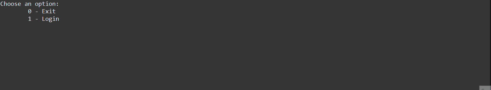
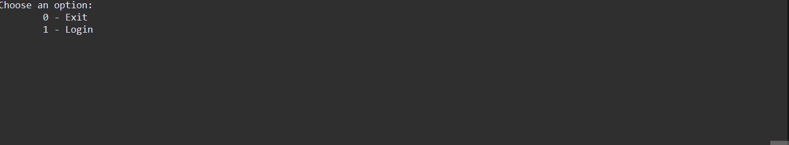

# Entra21 - Projeto - Equipe Amarela

Este projeto visa mostrar todos os conceitos aprendidos da linguagem JAVA até o momento, no curso de JAVA do programa [**Entra21**](https://www.entra21.com.br/). Esses conceitos foram aplicados e desenvolvidos pela equipe em uma aplicação JAVA.

A equipe composta pelos integrantes [**Alexsandro Correa**](https://github.com/Alexsandro-Correa), [**Ciro Ugalde**](https://github.com/Ciro-Ugalde), [**Stephanie Vieira**](https://github.com/Ste-Vieira), [**Lucas Corrêa Agostinho**](https://github.com/lucascagostinho) e trás como aplicação, à ideia de uma rede Social de prática de esprotes, o qual disponibiliza a possibilidade de uma criação de conta, controle do perfil e uma funcionalidade de controle de tempo da pratica do esporte.

O projeto atualmente está na sua versão da aplicação dos conceitos aprendidos até o momento do curso.

## Conceitos aplicados

#### Lógica de programação

- [x] Git (Repositório, README, replit)
- [x] Organização do Projeto (packages, subpackages, nomenclatura)
- [x] Elementos Básicos (variáveis, constantes e comentários)
- [x] Estruturas de decisão (if, else if, else, switch)
- [x] Laços de repetição (for, while, do while)
- [x] Modularização (métodos, retornos e recursividade)

#### Orientação a objetos

- [x] Classes (diagrama, atributos, construtores, encapsulamento, métodos, instanciar objetos)
- [x] Herança (extends, construtores com base na super classe)
- [x] Polimorfismo (interfaces)

#### Java avançado

- [x] Classes Wrapper
- [x] Enum
- [x] Annotations
- [x] Collections (ArrayList, LinkedList, HashSet, HashMap)
- [x] Funções Lambda
- [x] Generics
- [x] Dates
- [x] Exceptions

## Diagrama de classe

## Execução

> CRUD de usuários

> Função praticar

## Autores

**Alexsandro Correa** - Main: responsável pela navegação entre as ações , tratamento de exceptions e criação do trello para o time - [Github](https://github.com/Alexsandro-Correa)

**Ciro Ugalde** - CR-(UD) : responsável por escrever as classes que gerenciem ações de UPDATE(editar) / DELETE(excluir) itens nas listas de objetos mantidos em memória - [Github](https://github.com/Ciro-Ugalde)

**Stephanie Vieira** - (CR)-UD : responsável por escrever as classes que gerenciem ações de CREATE(adicionar) e READ(ler,buscar,listar) itens nas listas de objetos mantidos em memória - [Github](https://github.com/Ste-Vieira)

**Lucas Corrêa Agostinho** - Git: responsável por criar o repositório compartilhado e manter as documentações , diagrama de classes ,classes , herança e interfaces (interface até para as ações do CRUD) - [Github](https://github.com/lucascagostinho)